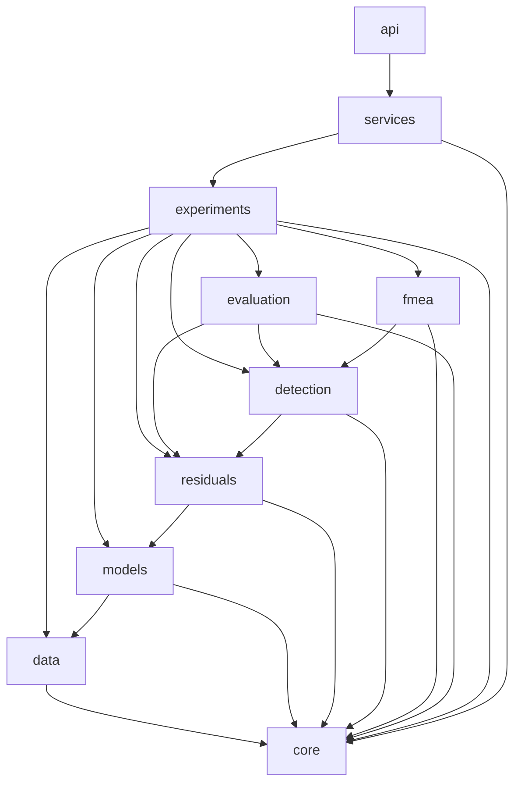
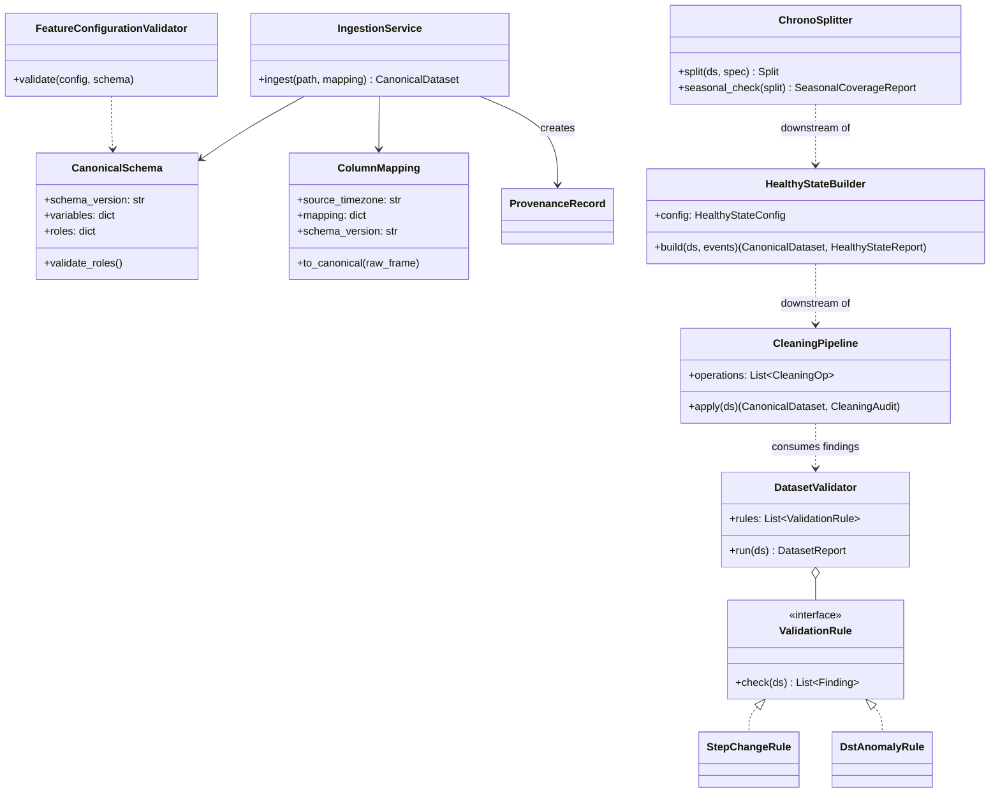
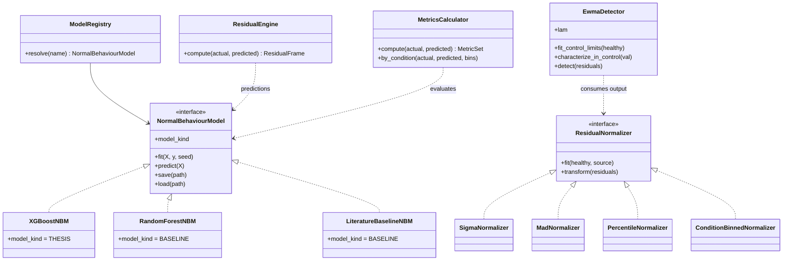
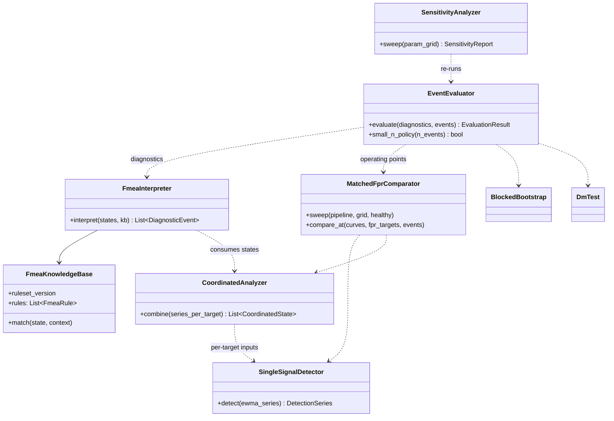
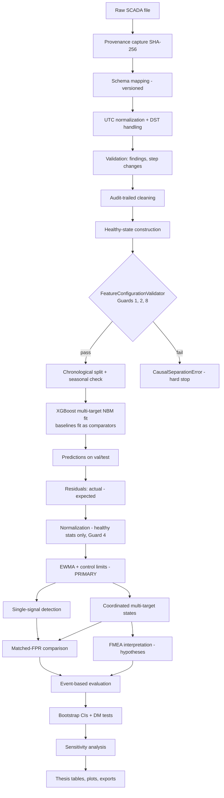
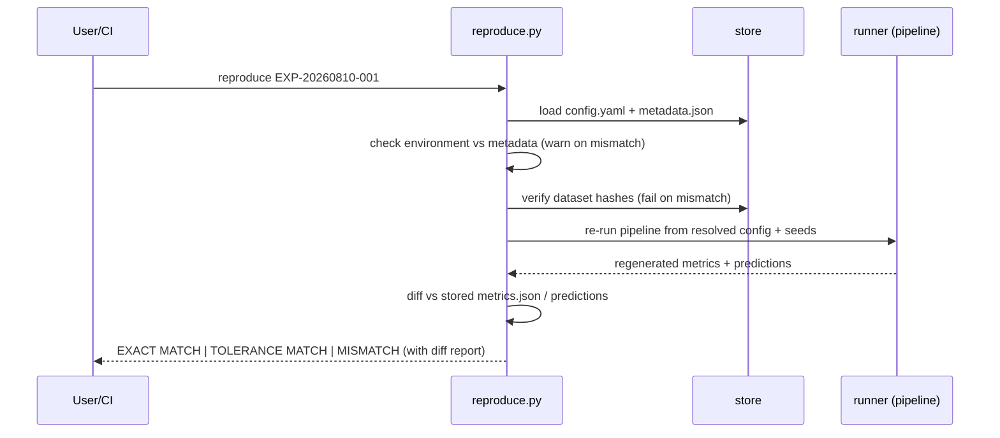

# ARCHITECTURE.md
# Wind Turbine Gearbox Diagnostic Application — Software Architecture

**Derived from:** PROJECT.md v2.0
**Status:** Design document — no implementation code. Interfaces are contracts; bodies are intentionally elided (`...`).
**Authority:** PROJECT.md §0 (LOCKED-01…10) governs this document. Any architectural element that would violate a lock is invalid by definition.

---

## 1. Purpose and Architectural Principles

This system is a research instrument, not a product. Its architecture optimizes, in order: scientific validity → reproducibility → data correctness → experiment management → evaluation → visualization → UI (PROJECT.md §4).

**Principles**

1. **Locks are structural, not conventional.** LOCKED constraints are enforced by code paths (guards, validators, absent modules), not by developer discipline. There is no `explainability/` package because SHAP is out of scope (LOCKED-07) — the architecture cannot express the violation.
2. **Layered, one-directional dependencies.** Higher layers depend on lower layers only. The scientific core never imports from `api/` or the frontend.
3. **Configuration-driven, artifact-first.** Every experiment is fully described by its config + dataset hash + code version; every result is a file in a versioned artifact directory. The database stores metadata and pointers, never scientific results of record.
4. **Guards as first-class components.** Scientific Guards 1–8 (PROJECT.md §33) are implemented as importable validator objects invoked at defined chokepoints, each with negative tests.
5. **Everything traceable.** Raw file → SHA-256 → cleaned data → healthy subset → split → model → residuals → EWMA series → detections → FMEA hypotheses → evaluation: each stage records its inputs' identities and its own transformation audit.
6. **UTC everywhere internally.** Timezone conversion happens exactly once, at ingestion (PROJECT.md §8). No internal component accepts naive or local timestamps.

---

## 2. Package Structure

```text
backend/app/
│
├── core/                       # Layer 0 — foundations (no scientific logic)
│   ├── config.py               # typed config loading (Pydantic), config hashing
│   ├── logging.py              # structured logging setup
│   ├── versioning.py           # schema_version, app version, git commit capture
│   ├── time.py                 # UTC utilities; rejects naive datetimes
│   └── errors.py               # exception hierarchy (see §12)
│
├── data/                       # Layer 1 — data acquisition & preparation
│   ├── schema.py               # canonical variable definitions, roles, units,
│   │                           #   schema_version (semver)
│   ├── mapping.py              # raw-column → canonical mapping (incl.
│   │                           #   mandatory source_timezone)
│   ├── provenance.py           # SHA-256 hashing, provenance records
│   ├── ingestion.py            # CSV/Parquet loaders → CanonicalDataset
│   ├── validation.py           # rule engine → Finding(INFO/WARNING/ERROR),
│   │                           #   DST checks, step-change detection
│   ├── cleaning.py             # audit-trailed cleaning operations
│   ├── healthy_state.py        # HealthyStateBuilder + HealthyStateReport
│   ├── splitting.py            # chronological / explicit-date / rolling-origin
│   │                           #   splits + seasonal coverage check
│   └── guards.py               # Guards 1, 2, 8: feature-configuration validator
│
├── models/                     # Layer 2 — Normal Behaviour Modelling
│   ├── base.py                 # NormalBehaviourModel interface
│   ├── xgboost_nbm.py          # THE thesis model (LOCKED-01)
│   ├── baselines.py            # RandomForest + literature-anchored comparator
│   ├── registry.py             # name → model class resolution
│   └── metrics.py              # RMSE/MAE/R²/bias (MAPE structurally absent),
│                               #   condition-sliced diagnostics
│
├── residuals/                  # Layer 3 — residual generation & treatment
│   ├── engine.py               # actual − expected; ResidualFrame
│   ├── normalization.py        # σ / MAD / percentile / condition-binned
│   └── ewma.py                 # PRIMARY treatment (LOCKED-02): EWMA series,
│                               #   control limits, empirical in-control
│                               #   false-alarm characterization
│
├── detection/                  # Layer 4 — anomaly decisions
│   ├── single.py               # per-signal detection on EWMA series
│   ├── comparators.py          # consecutive-exceedance / rolling rules
│   │                           #   (non-primary, labelled)
│   ├── coordinated.py          # multi-target state vectors ([-1,0,+1])
│   └── matched_fpr.py          # threshold sweeps, operating curves,
│                               #   matched false-alarm comparison
│
├── fmea/                       # Layer 5 — interpretation (LOCKED-03)
│   ├── knowledge_base.py       # YAML rule loading, ruleset versioning,
│   │                           #   validated-flag policy
│   └── interpreter.py          # pattern → candidate mechanisms (hypotheses)
│
├── evaluation/                 # Layer 6 — research evaluation
│   ├── events.py               # canonical alarm/maintenance/failure events
│   ├── event_eval.py           # event-level metrics, lead time, small-n policy
│   ├── bootstrap.py            # moving-block bootstrap CIs
│   ├── dm_test.py              # Diebold–Mariano with HAC variance
│   ├── sensitivity.py          # parameter sweeps, tornado summaries
│   └── comparison.py           # cross-experiment tables (thesis tables)
│
├── experiments/                # Cross-cutting — orchestration & tracking
│   ├── tracker.py              # ExperimentRecord, metadata capture
│   ├── runner.py               # pipeline orchestration per config
│   ├── store.py                # artifact directory layout + SQLite metadata
│   └── reproduce.py            # `reproduce EXP-ID` command
│
├── services/                   # Thin use-case coordinators for API/CLI
└── api/                        # Layer 7 — FastAPI (late; depends on services)
```

**Deliberately absent:** `explainability/` (LOCKED-07), any deep-learning module, any random-split utility exposed to thesis experiment paths (LOCKED-04).

---

## 3. Dependency Graph

Allowed import directions only. An arrow A → B means "A may import B". CI enforces this with an import-linter contract.



Rules:
- `core` imports nothing from the application.
- `data` knows nothing about models; `models` know nothing about residual treatment; `residuals` know nothing about FMEA. Each layer's outputs are plain typed data structures, so layers communicate through data, not through calls upward.
- `experiments` is the only package allowed to import from every scientific layer — it is the orchestrator.
- External libraries per layer: `data` → pandas/pyarrow/pydantic; `models` → xgboost/scikit-learn; `residuals`/`evaluation` → numpy/scipy/statsmodels; `fmea` → pyyaml. SHAP appears in no layer's dependency set.

---

## 4. Core Domain Objects

Typed, immutable-by-convention data structures (Pydantic models / frozen dataclasses). These are the contracts between layers.

```text
ProvenanceRecord      sha256, source_path, size, ingested_at_utc,
                      source_timezone, mapping_config_hash, supplier_note

CanonicalDataset      frame (UTC-indexed), schema_version, mapping_id,
                      provenance: ProvenanceRecord, roles: {column → role}

Finding               level (INFO|WARNING|ERROR), rule_id, message,
                      affected_rows, context

DatasetReport         findings: [Finding], row/column counts, date_range_utc,
                      turbines, sampling, dst_anomalies, step_changes

CleaningAudit         operations: [{rule, reason, before, after, removed}]

HealthyStateReport    totals, accepted, excluded, retention_pct,
                      exclusion_counts, date_ranges, turbines

SplitSpec / Split     strategy, fractions|dates, train/val/test index ranges,
                      seasonal_coverage: SeasonalCoverageReport

SeasonalCoverageReport  train_months, calendar_coverage, ambient_range_train,
                        ambient_range_test, warnings

FeatureConfig         predictors: [canonical names], targets: [canonical names],
                      engineered: [FeatureSpec]   # upstream-only by Guard 8

ResidualFrame         per target: timestamp_utc, turbine, actual, prediction,
                      raw_residual, normalized_residual   # raw never overwritten

EwmaSeries            per target: ewma_value, upper/lower control limits,
                      lambda, limit_spec, in_control_stats

DetectionSeries       per target: state ∈ {-1, 0, +1}, exceedance flags,
                      method_label (PRIMARY_EWMA | COMPARATOR_*)

CoordinatedState      timestamp_utc, turbine, vector: {target → state},
                      continuous: {target → ewma_value}

FmeaRule              id, mechanism, residual_pattern, confidence, rationale,
                      source, validated: bool, ruleset_version

DiagnosticEvent       timestamp_utc, turbine, severity, persistence,
                      pattern, candidates: [CandidateMechanism]

CandidateMechanism    mechanism, rule_id, confidence_category,
                      supporting_evidence, contradictory_evidence, rationale

OperationalEvent      turbine, timestamp_utc, event_type, component, description

EvaluationResult      detected/missed/false-alarm events, lead_times,
                      operating_point (FPR), inferential_allowed: bool

ExperimentRecord      see §8
```

---

## 5. Key Interfaces (contracts only)

### 5.1 Model layer

```python
class NormalBehaviourModel(Protocol):
    """Multi-target NBM contract. Thesis implementation: XGBoostNBM (LOCKED-01)."""

    def fit(self, X: pd.DataFrame, y: pd.DataFrame, *, seed: int) -> FitReport: ...
    def predict(self, X: pd.DataFrame) -> pd.DataFrame: ...          # one column per target
    def save(self, path: Path) -> None: ...
    @classmethod
    def load(cls, path: Path) -> "NormalBehaviourModel": ...
    @property
    def model_kind(self) -> ModelKind: ...                            # THESIS | BASELINE
```

`ModelKind` makes the thesis/baseline distinction machine-readable: comparison tables and exports label baselines automatically; only `THESIS`-kind results feed headline claims.

### 5.2 Guard layer

```python
class FeatureConfigurationValidator:
    """Guards 1, 2, 8. Invoked at the single chokepoint before any fit()."""

    def validate(self, config: FeatureConfig, schema: CanonicalSchema) -> None:
        """Raises CausalSeparationError on: target-as-predictor, future
        information, any target-derived feature (lag/rolling/diff/transform
        of a thermal target), thermally downstream variables."""
        ...

class SplitPolicyGuard:
    """Guard 3: rejects non-chronological splits for thesis-flagged experiments."""
    def validate(self, spec: SplitSpec, experiment_flags: ExperimentFlags) -> None: ...

class ThresholdProvenanceGuard:
    """Guard 4: normalization/threshold statistics must derive from healthy data
    partitions only; source partition recorded for the §22 open ADR."""
    def validate(self, stats_source: PartitionRef) -> None: ...
```

### 5.3 Residual treatment (PRIMARY = EWMA)

```python
class ResidualNormalizer(Protocol):
    def fit(self, healthy_residuals: ResidualFrame, source: PartitionRef) -> None: ...
    def transform(self, residuals: ResidualFrame) -> ResidualFrame: ...

class EwmaDetector:
    """LOCKED-02 primary treatment."""
    def __init__(self, lam: float, limit_spec: ControlLimitSpec) -> None: ...
    def fit_control_limits(self, healthy_normalized: ResidualFrame) -> None: ...
    def characterize_in_control(self, healthy_validation: ResidualFrame) -> InControlReport: ...
    def detect(self, normalized: ResidualFrame) -> tuple[EwmaSeries, DetectionSeries]: ...

class ComparatorDetector(Protocol):
    """Non-primary rules; every output carries method_label = COMPARATOR_*."""
    def detect(self, normalized: ResidualFrame) -> DetectionSeries: ...
```

### 5.4 Detection comparison

```python
class MatchedFprComparator:
    def sweep(self, pipeline: DetectionPipeline, grid: ThresholdGrid,
              healthy_periods: PeriodSet) -> OperatingCurve: ...
    def compare_at(self, curves: dict[str, OperatingCurve],
                   fpr_targets: list[float],
                   events: list[OperationalEvent]) -> ComparisonReport: ...
```

### 5.5 FMEA

```python
class FmeaKnowledgeBase:
    @classmethod
    def load(cls, path: Path) -> "FmeaKnowledgeBase": ...   # validates rule schema,
                                                            # stamps ruleset_version
    def match(self, state: CoordinatedState,
              context: OperatingContext) -> list[CandidateMechanism]: ...

class FmeaInterpreter:
    def interpret(self, detections: list[CoordinatedState],
                  kb: FmeaKnowledgeBase) -> list[DiagnosticEvent]: ...
    # Output language constraint: hypotheses only; "confirmed" is unrepresentable
    # in CandidateMechanism.confidence_category's enum.
```

### 5.6 Statistics

```python
class BlockedBootstrap:
    def __init__(self, block_length: int, n_boot: int, seed: int) -> None: ...
    def ci(self, series: np.ndarray, statistic: Callable) -> ConfidenceInterval: ...

def diebold_mariano(loss_a: np.ndarray, loss_b: np.ndarray,
                    hac_lags: int | None) -> DmResult: ...
```

---

## 6. Class Diagrams

### 6.1 Data layer



### 6.2 Model and residual layers



Note: `MetricSet` has no MAPE field — its absence is structural (PROJECT.md §19), and a test asserts the type exposes only RMSE/MAE/R²/bias.

### 6.3 Detection, FMEA, evaluation



---

## 7. Data Flow

### 7.1 End-to-end scientific flow



### 7.2 Artifact lifecycle

Every box above that produces science writes a file under the experiment's artifact directory (§8); the SQLite database stores only identities, hashes, configs, and pointers. Deleting the database loses convenience, not evidence.

---

## 8. Experiment Tracking Design

### 8.1 Identity and storage

```text
Experiment ID:      EXP-YYYYMMDD-NNN   (monotonic per day)
Config hash:        SHA-256 of the resolved config.yaml
Dataset identity:   provenance SHA-256 chain (raw → cleaned → healthy)
Code identity:      git commit hash + dirty flag
Environment:        runtime-captured versions of python, numpy, pandas,
                    scikit-learn, xgboost, scipy, statsmodels
```

```text
artifacts/EXP-YYYYMMDD-001/
├── config.yaml            # fully resolved, includes every default
├── metadata.json          # ExperimentRecord (below)
├── metrics.json           # metrics + CIs + DM results
├── model/                 # saved NBM(s), thesis and baselines separated
├── predictions/           # parquet
├── residuals/             # raw + normalized + EWMA series, parquet
├── plots/
└── evaluation/            # operating curves, event eval, sensitivity
```

### 8.2 ExperimentRecord (metadata.json contract)

```text
experiment_id, created_at_utc
schema_version
dataset: {ids, provenance_chain: [sha256...], turbines, date_range_utc}
configs: {cleaning, healthy_state, split, feature, model, residual,
          ewma, threshold, fmea_ruleset_version}
split: {spec, seasonal_coverage_report}
model: {type, model_kind, hyperparameters, tuning_configurations_evaluated}
seeds: {model, subsample, bootstrap, ...}      # per stochastic component
environment: {python, library_versions}
code: {git_commit, dirty}
guards: {validated: [G1, G2, G3, G4, G8], threshold_stats_source}
flags: {thesis_official: bool}                 # activates Guard 3 strictness
```

### 8.3 Reproduction sequence



CI runs this sequence on a small synthetic fixture experiment and asserts **EXACT MATCH** on predictions (PROJECT.md §15, §32).

### 8.4 Comparison layer

`evaluation/comparison.py` reads multiple `ExperimentRecord`s and emits thesis tables. It refuses to compare experiments whose `schema_version` or dataset provenance chains differ, unless explicitly overridden with a logged justification — preventing accidental apples-to-oranges tables.

---

## 9. Guard Enforcement Map

| Guard | Enforced in | Chokepoint | Failure mode |
|-------|-------------|-----------|--------------|
| G1 target-as-predictor | `data/guards.py` | before any `fit()` | `CausalSeparationError` |
| G2 future information | `data/guards.py` | before any `fit()` | `CausalSeparationError` |
| G3 no random splits (thesis) | `data/splitting.py` + `SplitPolicyGuard` | split creation when `thesis_official` | `SplitPolicyError` |
| G4 thresholds from healthy data | `residuals/normalization.py` + `ThresholdProvenanceGuard` | normalizer `fit()` | `ThresholdProvenanceError` |
| G5 failure intervals in training | `data/healthy_state.py` | healthy-state build | WARNING finding + LIMITATIONS.md entry |
| G6 synthetic labelling | fixture factory in `tests/` + plot/export watermarking | artifact generation | banner injected; export refuses unlabelled synthetic |
| G7 unvalidated FMEA rules | `fmea/knowledge_base.py` | rule load + every output | `UNVALIDATED RULE` label propagated to DiagnosticEvent |
| G8 target-derived features | `data/guards.py` | feature-engineering registration + before `fit()` | `CausalSeparationError`; engineered features must declare their source column, and any thermal-target source is rejected |

---

## 10. Configuration Architecture

- Single resolved config per experiment (YAML → Pydantic models in `core/config.py`); all defaults materialized before hashing, so `config.yaml` in the artifact directory is complete and standalone.
- Config sections mirror pipeline stages: `dataset`, `cleaning`, `healthy_state`, `feature`, `split`, `model`, `residual`, `ewma`, `detection`, `fmea`, `evaluation`, `sensitivity`.
- Provisional values (`fault_pre_exclusion_days`, `ewma_lambda`, control-limit multiplier, power floor) carry a `provisional: true` marker; the sensitivity analyzer discovers them by this marker, and comparison tables footnote any result still resting on provisional values.
- Open ADRs surface as config enums (e.g., `threshold_stats_source: training | validation`) so both branches exist in code while the thesis decision remains recorded in `docs/DECISIONS.md`.

---

## 11. Testing Strategy

### 11.1 Test pyramid

```text
E2E (few):          synthetic fixture → full pipeline → reproduce → EXACT MATCH
Integration (some): stage pairs (ingest+validate, model+residual,
                    ewma+detection, detection+fmea, eval+stats)
Unit (many):        every rule, guard, normalizer, metric, and parser
```

### 11.2 Fixture policy

- One small synthetic SCADA fixture (multi-turbine, UTC-clean and DST-dirty variants), generated by a seeded factory, watermarked `SYNTHETIC TEST DATA — NOT VALID THESIS EVIDENCE`.
- Fixtures contain **no fault labels** (LOCKED-08). Detection tests verify mechanics (thresholds fire when residuals are constructed to exceed limits), never detection performance claims.
- Hand-computed reference values checked in as literals for: EWMA recursion, control limits, MAD normalization, DM statistic, bootstrap on a tiny series.

### 11.3 Per-layer test obligations (from PROJECT.md §32)

| Layer | Must-pass tests |
|-------|-----------------|
| data | mapping round-trip; schema-version stamping + old-version warning; UTC conversion incl. DST fold/gap fixtures; duplicate/missing/ordering findings; step-change detection on synthetic step; healthy-state exclusion accounting; chronological split boundaries; seasonal-coverage WARNING below 12 months |
| guards | **negative tests for every Guard 8 feature class**: lagged target, rolling target, target diff, target transform — each must raise; G1/G2/G3/G4 violation tests |
| models | fit/predict shape contracts (multi-target); save→load→predict equality; seed determinism (bit-identical predictions); `MetricSet` exposes no MAPE |
| residuals | actual−prediction identity; raw preserved after normalization; each normalizer vs reference; EWMA values + limits vs hand-computed reference; in-control characterization runs on healthy fixture |
| detection | state encoding {-1,0,+1}; comparator labelling; matched-FPR sweep monotonicity and curve serialization |
| fmea | match / non-match / multiple-match / ranking; unvalidated label propagation; rule-schema rejection of malformed YAML; "confirmed" unrepresentable in confidence enum |
| evaluation | event matching, lead-time sign convention, missed/false-alarm counting; small-n policy triggers descriptive mode; bootstrap CI coverage on synthetic AR(1); DM vs reference implementation |
| experiments | metadata completeness (schema-validated); artifact layout; `reproduce` EXACT MATCH on fixture; refusal to compare mismatched provenance |

### 11.4 CI gates (GitHub Actions, every push/PR)

```text
1. ruff (lint + format check)
2. mypy (type check)
3. import-linter (dependency-direction contract, §3)
4. pytest with coverage report
5. fixture reproduction test (EXACT MATCH)
Red pipeline blocks merge.
```

### 11.5 What tests deliberately do not do

- No tests assert scientific conclusions (e.g., "multi-target beats single") — tests protect mechanics and reproducibility; science is decided by experiments on real data.
- No test uses random train/test splitting helpers on thesis-flagged paths; a meta-test asserts no such helper is importable from `experiments/runner.py`.

---

## 12. Error and Findings Taxonomy

```text
AppError
├── ConfigError                  # malformed/unresolvable configuration
├── SchemaError                  # schema-version or role violations
├── TimezoneError                # unknown source_timezone → stop-and-ask
├── ProvenanceError              # hash mismatch, missing provenance
├── CausalSeparationError        # Guards 1, 2, 8
├── SplitPolicyError             # Guard 3
├── ThresholdProvenanceError     # Guard 4
├── FmeaRuleError                # malformed ruleset
└── ReproductionMismatch         # reproduce diff failure
```

Data-quality issues are **Findings** (INFO/WARNING/ERROR data), not exceptions — the pipeline reports them and lets configuration decide consequences. Methodology violations are **exceptions** — they stop execution unconditionally. This separation keeps "the data is imperfect" distinct from "the science is being done wrong."

---

## 13. Extension Points and Non-Goals

**Extension points:** new dataset adapters (mapping configs), additional normalizers, additional comparator detectors, additional FMEA rules (via YAML + sign-off workflow), rolling-origin evaluation mode, LightGBM comparator (ADR-gated).

**Non-goals (structural):** SHAP/XAI of any kind; deep-learning models; random splitting on thesis paths; synthetic fault labels; distributed infrastructure (queues, Redis, Kubernetes); frontend before the scientific core is complete. These are not "not yet" — the architecture is shaped so their absence is verifiable (no module, no dependency, guard-blocked path, or meta-test).
